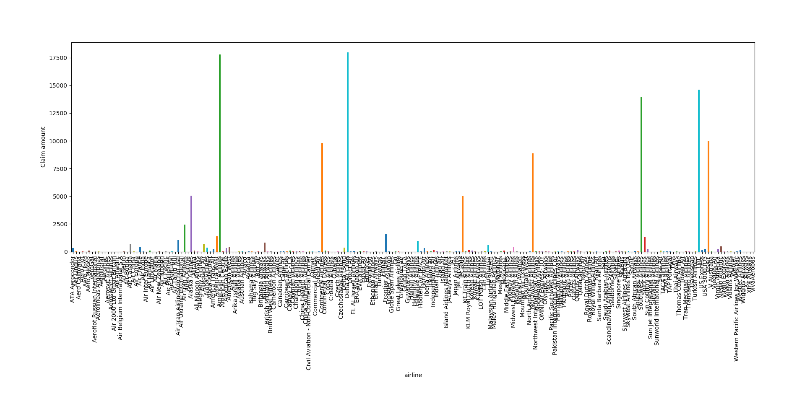
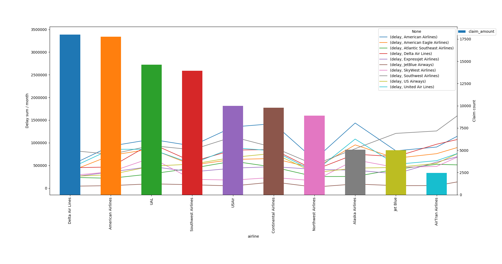

# graphs
Firest off the graphs were plotted with datastudio.
The problem I had with datastudio was that I had to process alot of the data before hand, and coudn't sum up,m or aggregate the data like I needed.

[Here is a link to tthe report](https://datastudio.google.com/embed/reporting/1c4qP_OnsTjOXpLOW9RgIkri9FjE4GrWo/page/B4aM)

Then I decided to use pandas, that can directly plot graphs using python.

This choice was smarter because I didn't have to reimport my data all the time, and could modify the groupngs, etc...

This lead to the following plots:

1. Number of claims per month

2. Total delays per month, per airline

With a bit of filtering out only the 10 biggest

3. Total amount of value lost by company

Sorted this gives

4. Mean average of delays per month, per airline

5. Most valuable lost item per airline

Sorted and taken only the 10 biggest ones gives us:

6. Final graph

